tiny-httpd，一个小型http服务器

代码来源：[https://github.com/EZLippi/Tinyhttpd](https://github.com/EZLippi/Tinyhttpd) 非官方。本项目在来源的基础上进行修正，确保能在指定环境下正常运行，修正内容见：[https://github.com/EZLippi/Tinyhttpd/issues/38](https://github.com/EZLippi/Tinyhttpd/issues/38)

代码官方链接：[https://sourceforge.net/projects/tiny-httpd/](https://sourceforge.net/projects/tiny-httpd/)

实验环境：

- 本地环境：Windows10
- 虚拟机：Vmware/Ubuntu18
- 火狐浏览器
- apache2


项目需要使用CGI脚本，所以需要配置相关环境，原文：https://techexpert.tips/apache/perl-cgi-apache/

```shell
sudo apt-get update

sudo apt-get install perl
sudo apt-get install apache2

service apache2 restart

cd /usr/lib/cgi-bin

sudo vim /usr/lib/cgi-bin/test.pl

chmod 755 /usr/lib/cgi-bin/test.pl
```

perl测试脚本内容：

```perl
#!/usr/bin/perl
print "Content-Type: text/html\n\n";
print ("<h1>Perl is working!</h1>");
```

然后访问本地 证明环境已经配置成功

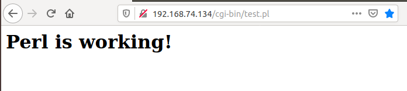

图1


接下来就开始分析主函数httpd.c

### 程序主要包含以下函数：

其中主要功能函数：

main函数：主函数，主要用于指定端口并调用初始化服务

startup函数：初始化http服务，包括建立套接字、绑定端口、进行监听等操作

accept_request函数：接收一个客户端描述符，处理相关请求

execute_cgi函数：运行CGI程序

以及辅助函数：

bad_request函数：通知客户端这是个错误请求，即400错误

cat函数：功能类似于Linux下的cat指令

cannot_execute函数：通知客户端该CGI脚本不能被执行，即500错误

error_die函数：错误输出函数并执行exit

get_line函数：从套接字中读取信息并将所有的换行符等统一转换为换行符'\n'

headers函数：返回HTTP头部信息

not_found函数：通知客户端没有找到状态信息，即404错误

serve_file函数：调用cat函数将服务器数据返回给浏览器

unimplemented函数：通知客户端method无法实现，即501错误


### 整个程序的工作流程图如下所示：

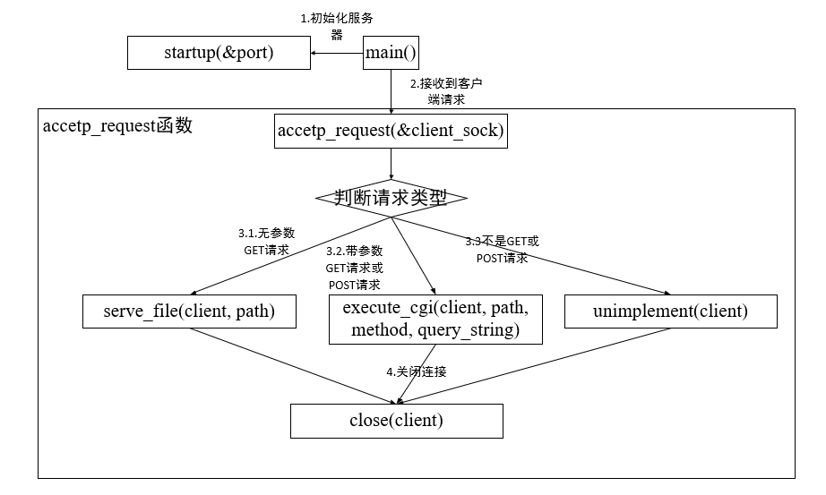

图2

### execute_cgi函数的执行流程如下图：

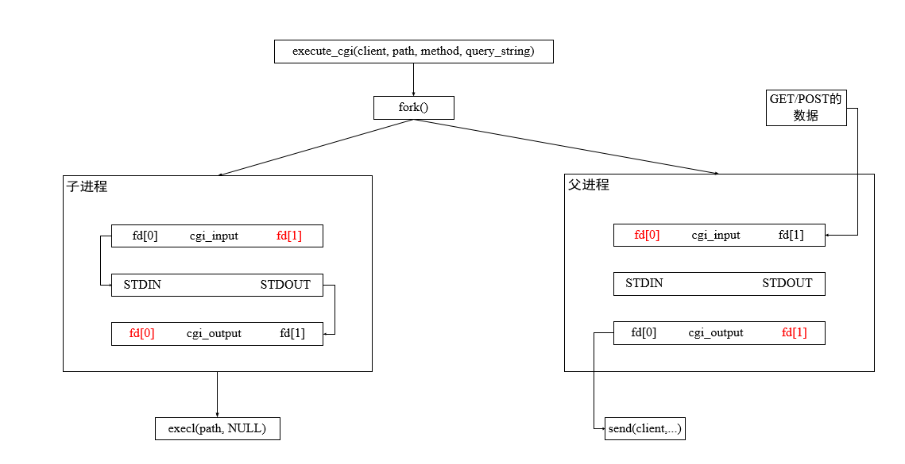

图3

### 管道

本实验的难点就在于这个管道上的理解，个人理解如下：

1. 首先在父进程中创建两个管道cgi_input和cgi_output，cgi_input[0]等同于上图中cgi_input管道中fd[0]，其余与之相似；
2. 调用fork函数产生子进程，那么子进程便会拥有相同的文件描述符，在子进程中，将STDIN重定向到cgi_input[0]，将STDOUT重定向到cgi_output[1]，并关闭cgi_input[1]和cgi_output[0]，上图已用红色标出被关闭的文件描述符；
3. 回到父进程，父进程先关闭cgi_input[1]和cgi_output[0]，然后向cgi_input[1]，即cgi_input管道的写入端写入数据，cgi_input[1]的功能就是将数据流写入到cgi_input这个管道中，对应原文代码如下：

```c
            for (i = 0; i < content_length; i++)
            {
                recv(client, &c, 1, 0);
                write(cgi_input[1], &c, 1);
            }
```

4. 等到父进程写入数据完成后，由子进程开始进行数据流的处理，由上一步可知，数据流已经被cgi_input[1]写入到管道了，那么使用cgi_input[0]，即cgi_input的读取端进行操作，数据流就会流向cgi_input[0]，由第2步可知，STDIN已经被重定向到cgi_input[0]了，所以，在这一步，数据流最终流向了cgi_output管道；
5. 再回到父进程，由上一步可知，数据流已经存储到cgi_output管道了，那么使用cgi_output[0]对管道内的数据进行读取，父进程就可以获取数据了，然后执行send发送回客户端，代码如下：

```c
        while (read(cgi_output[0], &c, 1) > 0) 
            send(client, &c, 1, 0);           
```

关于管道的补充：

1. 我的理解是，管道本身并没有被fork影响，因为管道就是用来父子进程通信，经过fork被子进程复制一份的是文件描述符，即cgi_input[0]等
2. 为什么父子进程要分别先关闭两个文件描述符？因为管道的半双工的，通过关闭/打开不同的文件描述符可以控制数据流的方向，详情可以参考《UNIX环境高级编程》3rd P430，这里附上一张书上的图

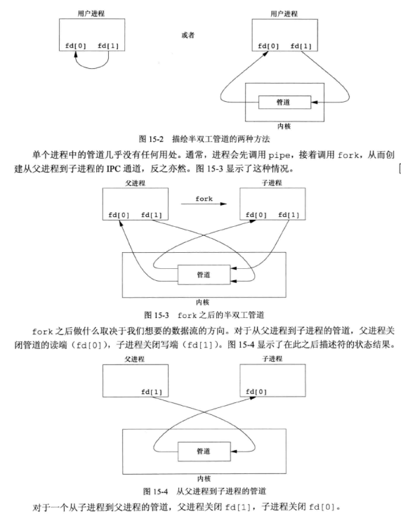

图4

### 程序执行效果

1. 在Ubuntu环境下，首先执行make，会生成httpd

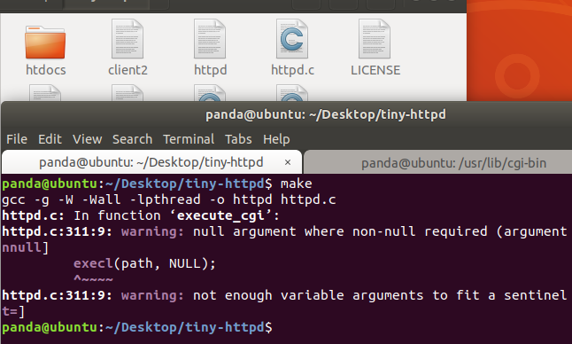

图5

2. 执行`which perl` 保证htdocs目录下的check.cgi和color.cgi的开头和本地一样，如果不一样就要改一下

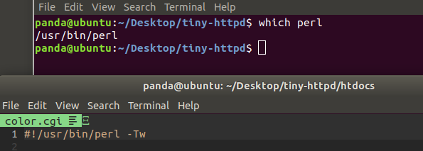

图6

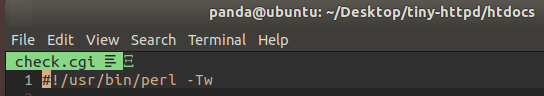

图7

3. 进入htdocs目录，使用`ls -l`查看一下权限，这里要注意，index.html的权限刚开始可能是777，如果访问浏览器却没有反馈，可以将index.html的权限改成600

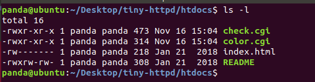

图8

4. 执行httpd

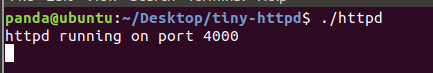

图9

5. 在浏览器端访问

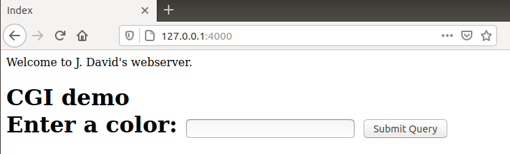

图10

6. 输入一种颜色并提交

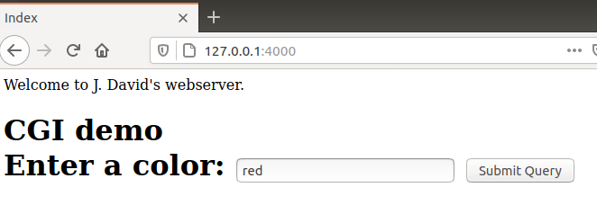

图11


图12


本文的主要逻辑以及函数功能如上所述，详细的代码注释见源码


